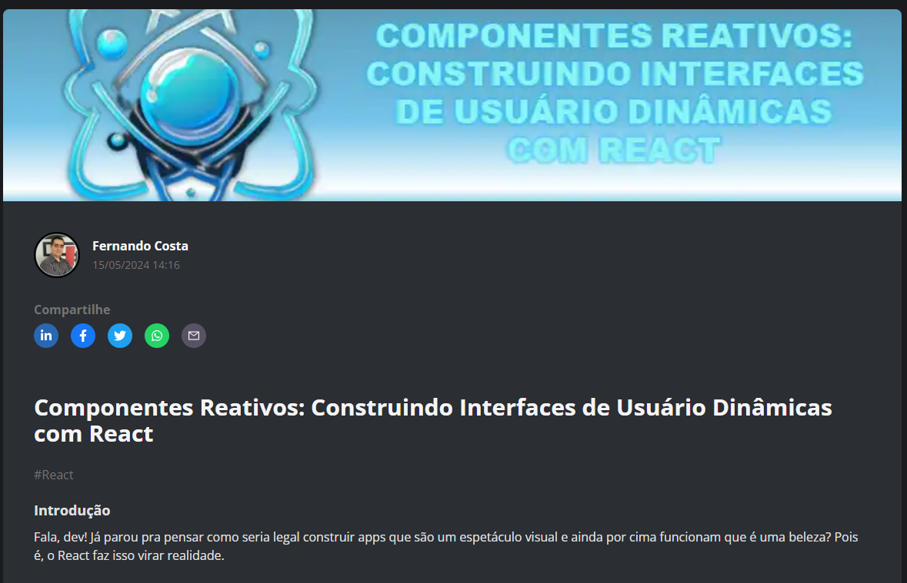

    

  
  

-------

  

# Projeto artigo técnico gerado por I.A.s

 > ℹ️ **NOTE:** Este é o repositório desenvolvido durante o Bootcamp Santander no qual fui aluno na plataforma da [DIO](https://dio.me).

Projeto com o objetivo de gerar um artigo técnico com um layout rico e leitura agradável.

<a href="https://www.dio.me/articles/componentes-reativos-construindo-interfaces-de-usuario-dinamicas-com-react" title="View PDF now"> 📕Clique aqui para ler o artigo</a>

## 💻 Tecnologias utilizadas no projeto

- [Copilot](https://copilot.microsoft.com/) - para título, conteúdo e imagens.
- [PowerPoint](https://www.microsoft.com/en/microsoft-365/powerpoint) - Para formatação de banners.

## 📄 Prompts e ferramentas

Copilot：

|   Ação   | prompt                                                                                                                                                                                                                                                                         |
| :------: | ------------------------------------------------------------------------------------------------------------------------------------------------------------------------------------------------------------------------------------------------------------------------------ |
|  Título  | Crie 10 headlines para nomes de artigos sobre o assunto React                                                                                                                                                                                                    |
| Conteúdo | Comporte-se como um escritor de artigos frontend e faça um texto para um artigo sobre: Componentes Reativos: Construindo Interfaces de Usuário Dinâmicas com React. {REGRAS} Faça 5 linhas de explicação por bloco com um código para exemplo, faça explicando para um desenvolvedor júnior e faça um call to action no final |

## ✨ Features

- Conteúdo gerado via Copilot

## 🛠️ Instruções de execução

Utilize os prompts acima nas ferramentas sugeridas para gerar o material base e utilize uma ferramenta de edição de documentos.

## 👨‍💻 Expert

    
    
&nbsp&nbsp&nbspFERNANDO R COSTA 
    &nbsp&nbsp&nbsp
    <a href="https://github.com/fernando-r-costa">
    GitHub</a>&nbsp;|&nbsp;
    <a href="https://www.linkedin.com/in/fernando-r-costa/">LinkedIn</a>

 

---

